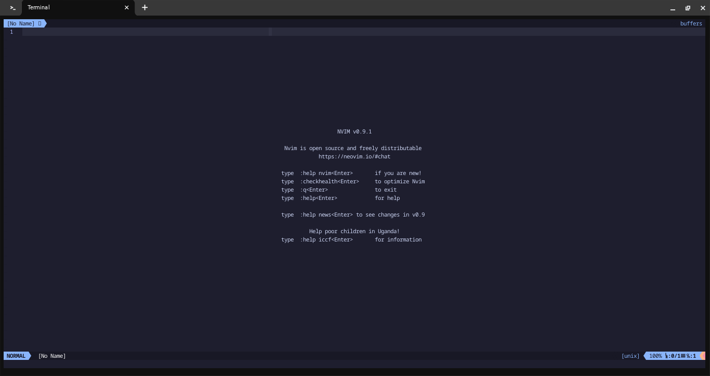
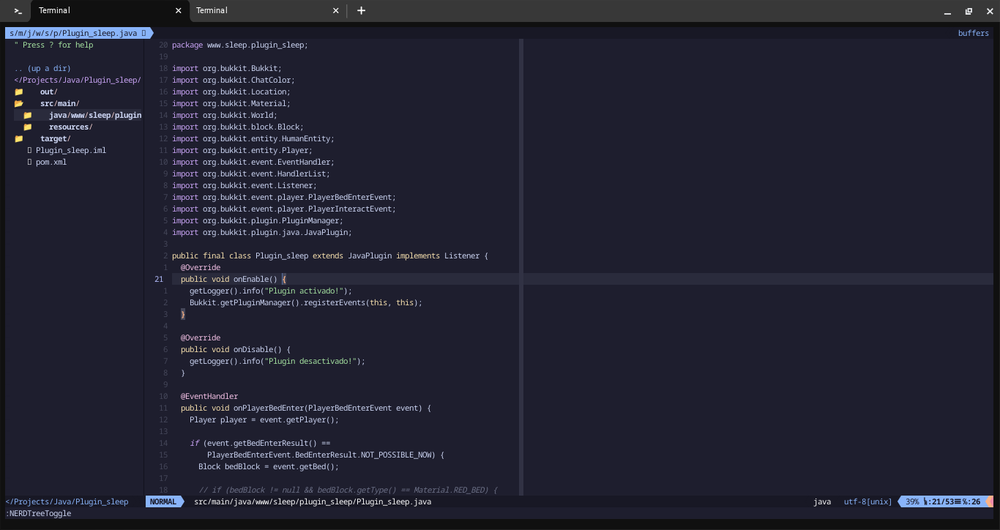
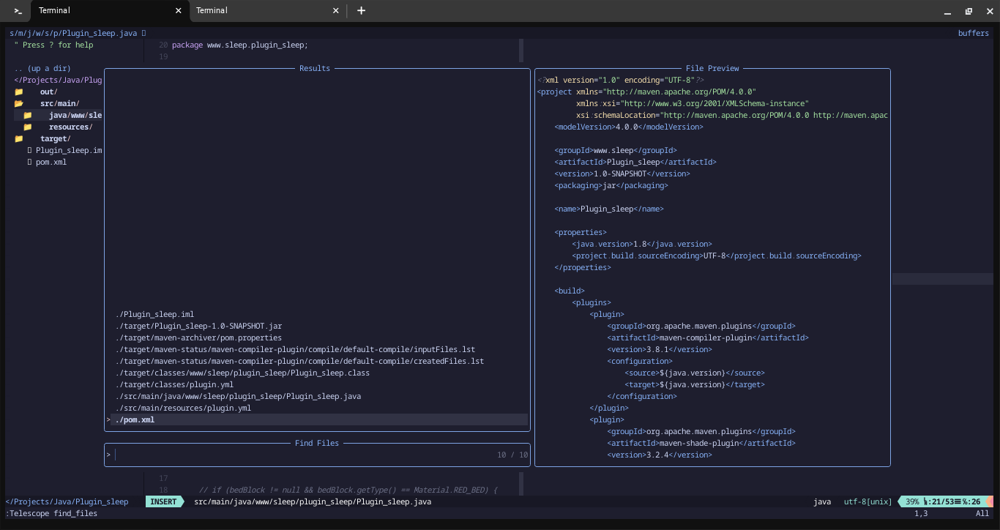

<div align="center">

# :computer: Neovim configuration :coffee:


</div>

### This repository contains my custom configuration for neovim.

### Feel free to explore and use any section of my configuration that you find useful.

> __Note__
> #### That this configuration will gradually change to suit my personal tastes more and more

---

<details>
 	<summary><h2>Dependencies</h2></summary>

<div align="center">

```console
foo@bar:~$ sudo apt install python3-pip
```

```console
foo@bar:~$ python3 -m pip install pipenv
```

```console
foo@bar:~$ sudo apt install python3-neovim
```

</div>
</details>

<details>
 	<summary><h2>Screenshot</h2></summary>

<div align="center">





</div>
</details>

